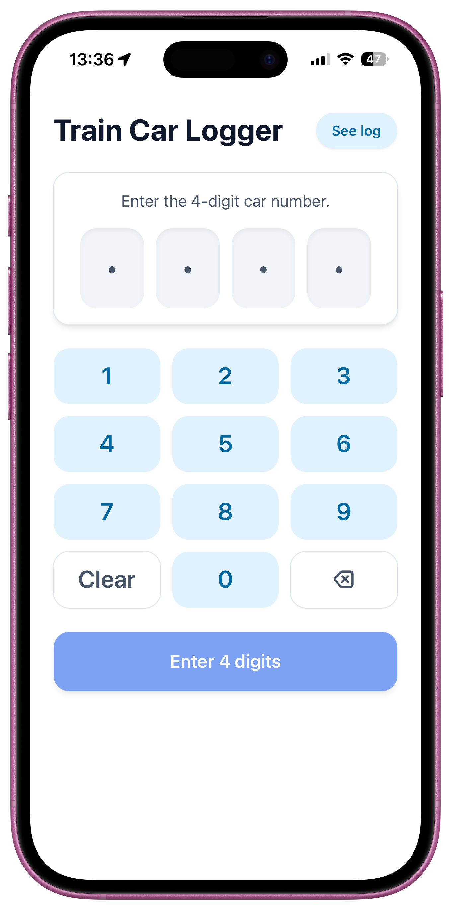
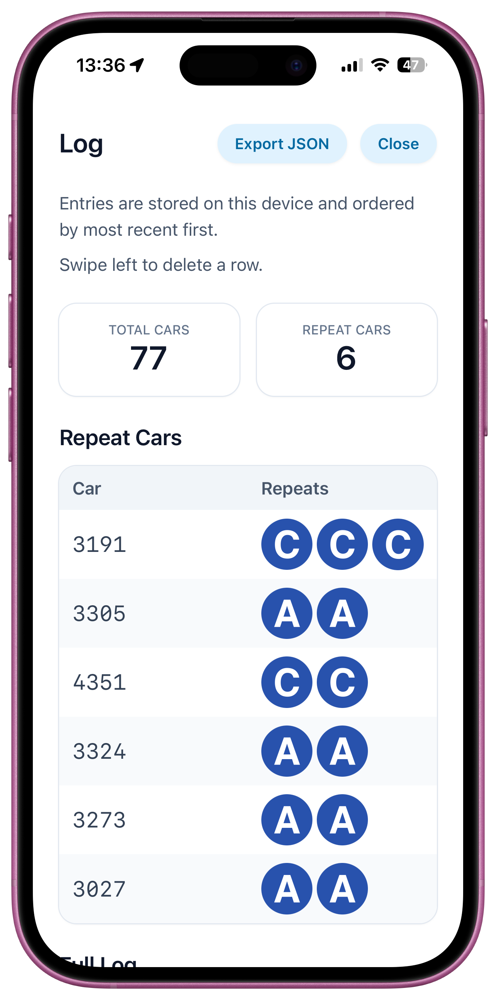
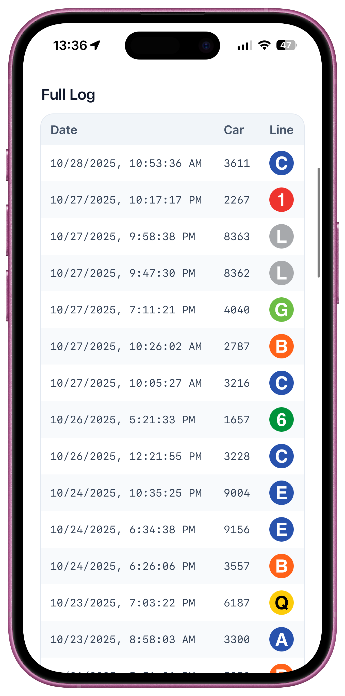

# Train Car Logger

React + TypeScript single-page app for logging NYC subway train cars.

|             Screenshot 1             |             Screenshot 2             |             Screenshot 3             |
| :----------------------------------: | :----------------------------------: | :----------------------------------: |
|  |  |  |

## Local development

- Install dependencies with `npm install`
- Start the dev server with `npm run dev`

## Build

- Run `npm run build` to create the production bundle in `dist/`.
